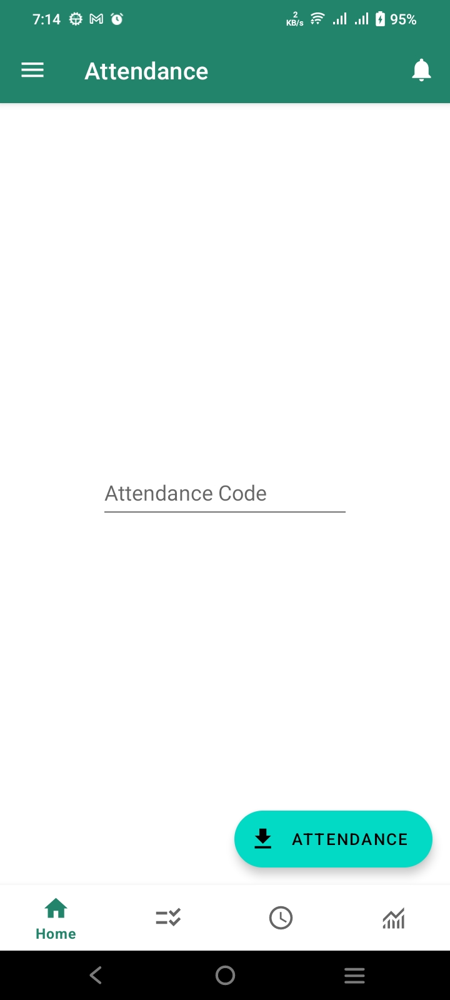
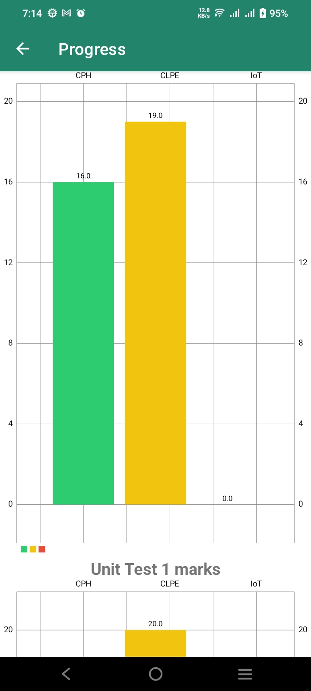
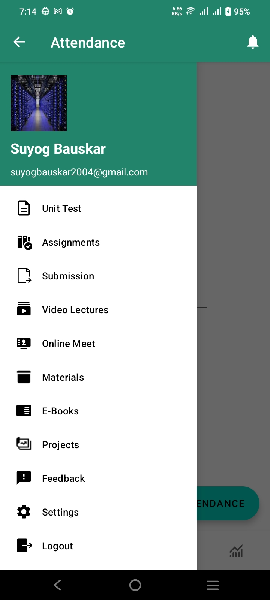

# 📚 **ClassSync Student App**  

**ClassSync** is a feature-packed Android application designed to simplify student life by organizing academic tasks, tracking progress, and keeping everything in sync with their class schedules.

---

## ✨ **Features**  

- ✅ **Attendance Tracking**:  
  Easily monitor your attendance and download detailed reports in Excel format.  
- 📝 **Assignments & Tests**:  
  Stay updated with upcoming assignments and test scores.  
- 🎥 **Video Lectures**:  
  Access lecture videos anytime, anywhere.  
- 📅 **Timetable Display**:  
  Keep track of your daily schedule with an organized timetable.  
- 📊 **Marks and Feedback**:  
  Get instant access to your test results and faculty feedback.  
- 🌐 **Firebase Integration**:  
  Powered by Firebase for authentication, real-time data, and cloud-based functions.

---

## 🚀 **Tech Stack**  

- **Programming Language**: Java ☕  
- **Backend**: Firebase 🔥 (Authentication, Realtime Database, Cloud Functions)  
- **Tools**: Android Studio 🛠️  

---

## 📱 **Screenshots**  

<p align="center">
  
  
  
</p>

---

## 🛠️ **How to Install**  

1. **Clone the repository**:  
   ```bash
   git clone https://github.com/yourusername/ClassSync-Student-App.git
